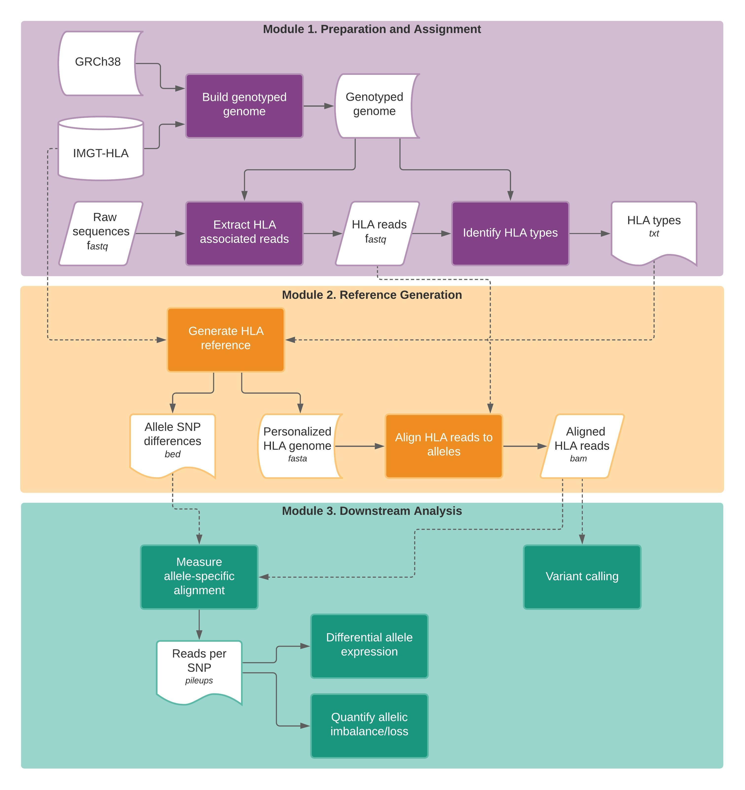

Analysis
=========

Module 1. Preparation and assignment
-------------------------------------

#####################
HLA read extraction
#####################
Reads associated with the HLA gene loci are extracted using HISAT-genotype. The ``hisatgenotype_extract_reads`` file has been modified to work with either DNA or RNA sequencing reads (enabling split-read sequence alignment through HISAT2).

Extract HLA-associated reads from DNA sequencing data::

  export PATH=/opt/hisat2/hisat2-hisat2_v2.2.0_beta:/opt/hisat2/hisat2-hisat2_v2.2.0_beta/hisatgenotype_scripts:$PATH
  export PYTHONPATH=/opt/hisat2/hisat2-hisat2_v2.2.0_beta/hisatgenotype_modules:$PYTHONPATH
  export PATH=$PATH:/opt/samtools/bin
  /opt/hisat2/hisat2-hisat2_v2.2.0_beta/hisatgenotype_extract_reads_v_KC.py --base ${hisat_prefix} \
  -1 ${fq1} -2 ${fq2} --database-list hla

To extract HLA-associated reads from RNA sequencing data, just add the ``--is-rna`` flag to the command::

    export PATH=/opt/hisat2/hisat2-hisat2_v2.2.0_beta:/opt/hisat2/hisat2-hisat2_v2.2.0_beta/hisatgenotype_scripts:$PATH
    export PYTHONPATH=/opt/hisat2/hisat2-hisat2_v2.2.0_beta/hisatgenotype_modules:$PYTHONPATH
    export PATH=$PATH:/opt/samtools/bin
    /opt/hisat2/hisat2-hisat2_v2.2.0_beta/hisatgenotype_extract_reads_v_KC.py --base ${hisat_prefix} \
    -1 ${fq1} -2 ${fq2} --is-rna --database-list hla

Reads may also be extracted from single reads, using the ``-U`` option instead of paired ``-1`` and ``-2`` reads::

    export PATH=/opt/hisat2/hisat2-hisat2_v2.2.0_beta:/opt/hisat2/hisat2-hisat2_v2.2.0_beta/hisatgenotype_scripts:$PATH
    export PYTHONPATH=/opt/hisat2/hisat2-hisat2_v2.2.0_beta/hisatgenotype_modules:$PYTHONPATH
    export PATH=$PATH:/opt/samtools/bin
    /opt/hisat2/hisat2-hisat2_v2.2.0_beta/hisatgenotype_extract_reads_v_KC.py --base ${hisat_prefix} \
    -U ${fq1} --is-rna --database-list hla

#####################
HLA typing
#####################
HLA typing can be applied to 26 genes, spanning 7Mb in chromosome 6p21.3, including classical and non-classical Class I/II HLA genes, non-expressed Class I HLA pseudogenes, ATP binding cassette transporter genes, Class I chain-related and Class I-like genes: *HLA-A, HLA-B, HLA-C, HLA-DMA, HLA-DMB, HLA-DOA, HLA-DOB, HLA-DPA1, HLA-DPB1, HLA-DPB2, HLA-DQA1, HLA-DQB1, HLA-DRA, HLA-DRB1, HLA-E, HLA-F, HLA-G, HLA-H, HFE, HLA-K, HLA-L, MICA, MICB, TAP1, TAP2,* and *HLA-V*. These are specified as a comma-delimited list in the following HLA typing command by the `--locus-list` option.

.. note::
    Do not include "HLA-" when specifying HLA genes (e.g. use ``--locus-list A`` instead of ``--locus-list HLA-A``). Typing generally takes the longest on the HLA-A locus, and this command can be scattered across each loci individually, followed by report aggregation and summary (See Analysis > Suggested Workflow).

Docker Commands (kcampbel/rnaseq_methods:v3)::

    export PATH=/opt/hisat2/hisat2-hisat2_v2.2.0_beta:/opt/hisat2/hisat2-hisat2_v2.2.0_beta/hisatgenotype_scripts:$PATH
    export PYTHONPATH=/opt/hisat2/hisat2-hisat2_v2.2.0_beta/hisatgenotype_modules:$PYTHONPATH
    export PATH=$PATH:/opt/samtools/bin
    /opt/hisat2/hisat2-hisat2_v2.2.0_beta/hisatgenotype_locus_v_KC.py --genotype-genome ${hisat_prefix} \
    -1 ${fq1} -- ${fq2} --base hla --locus-list ${locus} --output-base ${name}.${locus} --keep-low-abundance-alleles

Options for single-read sequencing (``U``) and RNA sequencing (``--is-rna``) can also be used for HLA typing.

Module 2. Reference Generation
-------------------------------------
HISAT-genotype will output a ranked list of HLA types for each locus, based upon those that meet the expectation maximization algorithm. Documentation for HISAT-genotype suggests using the alleles ranked 1 or 2, from hisatgenotype_locus.py for each gene, and the alleles may be reported up to the 4th field of resolution, which describes genomic differences in alleles outside of the coding regions. However, WES may not have sufficient sequencing coverage and RNAseq data would not be appropriate for detecting this level of information. HLA-HAT provides an R script to summarize the HLA typing reports from HISAT-genotype.

########################
HLA haplotype reporting
########################

Aggregate all report files using the following command::

    grep "ranked" *report > ${name}.hla_types.txt

The ``generate_reference_files.R`` script is used to generate the reference fasta, and can be specified in the Docker container kcampbel/hlahat_r:v3::

    Rscript /code/generate_reference_files.R ${name} ${name}.hla_types.txt ${n_fields} ${sep="," gen_msf_list} ${sep="," nuc_msf_list}

.. list-table::
   :header-rows: 1
   :align: center
   :widths: auto

   * - Parameter
     - Type
     - Description
   * - name
     - String
     - Identifier (prefix) for output files
   * - hlatypes_file
     - File
     - Path to file containing the ranked text output from HISAT-genotype (Called ``${name}.hlatypes.txt`` from previous ``grep`` command)
   * - n_fields
     - Int
     - Number of fields to include in HLA type output (current options: 2 or 3)
   * - gen_msf_list
     - File list
     - Comma-delimited list of file paths for gen.msf files from IMGT-HLA
   * - nuc_msf_list
     - File list
     - Comma-delimited list of file paths for nuc.msf files from IMGT-HLA

The R script ``generate_reference_files.R`` is provided for summarizing the HLA typing performed by HISAT-genotype, and outputs the following files:

- ``all_hlatypes.tsv`` Includes **all** ranked types outputted by HISAT-genotype.
- ``top_hlatypes.tsv`` Summarizes the top ranked 1-2 alleles, which are used for subsequent custom reference genome generation.
- ``find_hlatypes.tsv`` Summarizes the individual-specific HLA reference, including which genomic DNA and CDS are aclosest and available for the HLA haplotype of the patient. Note that the genomic DNA sequence is not available for all HLA types.
- ``custom_hla.fasta`` Reference file containing the genomic DNA sequences of the Individual reference alleles
- ``custom_hla.allelic_differences.bed`` Includes a bed file of all SNP differences between alleles in heterozygous genes, mapped to ``custom_hla.fasta`` reference

The ``${id}.all_types.tsv`` file includes all alleles ranked by HISAT-genotype; however, sometimes this list includes more than two ranked HLA alleles (Based upon the shared sequence homology across alleles). Thus, ``all_hlatypes`` is reduced to ``top_hlatypes`` based upon the percentage abundance quantitation, and annotated by ``find_hlatypes`` based upon the genomic DNA and CDS sequences available. Note that IMGT-HLA does not provide genomic DNA sequences for all HLA alleles, but many common types are accounted for.

By default, all alleles are reduced to their fullest up the third field of resolution (e.g. A*02:89 would remain A*02:89, while A*03:01:01:01 is reduced to A*03:01:01). Then, alleles up to the third field of resolution are summarized by the maximum percent abundance across those that are shared. Any alleles with less than 5% abundance are removed, and then the remaining one or top two alleles (at the third field of resolution) are chosen as the HLA types.

*Example*: If the following Class I alleles are ranked in the report from HISAT-genotype, ``{id}.all_types.tsv`` file would be outputted: 

.. list-table::
   :widths: auto
   :align: center
   :header-rows: 1

   * - ranks
     - alleles
     - gene
     - perc_abundance
   * - 1
     - A*02:01:01:01
     - A
     - 40.85
   * - 2
     - A*33:01:01
     - A
     - 31.63
   * - 3
     - A*33:03:23
     - A
     - 13.97
   * - 4
     - A*34:01:01
     - A
     - 4.52
   * - 5
     - A*34:05
     - A
     - 4.52
   * - 6
     - A*34:14
     - A
     - 4.52
   * - 1
     - B*14:02:01:01
     - B
     - 50.79
   * - 2
     - B*15:01:01:01
     - B
     - 37.33
   * - 3
     - B*15:01:01:03
     - B
     - 11.87
   * - 1
     - C*08:02:01:01
     - C
     - 51.18
   * - 2
     - C*03:03:01:01
     - C
     - 48.82

``generate_reference_files`` performs the following filtering, to report the HLA haplotypes. First, alleles are summarized to the third field of resolution:

.. list-table::
   :widths: auto
   :align: center
   :header-rows: 1

   * - ranks
     - alleles
     - gene
     - perc_abundance
   * - 1
     - A*02:01:01
     - A
     - 40.85
   * - 2
     - A*33:01:01
     - A
     - 31.63
   * - 3
     - A*33:03:23
     - A
     - 13.97
   * - 4
     - A*34:01:01
     - A
     - 4.52
   * - 5
     - A*34:05
     - A
     - 4.52
   * - 6
     - A*34:14
     - A
     - 4.52
   * - 1
     - B*14:02:01
     - B
     - 50.79
   * - 2
     - B*15:01:01
     - B
     - 37.33
   * - 3
     - B*15:01:01
     - B
     - 11.87
   * - 1
     - C*08:02:01
     - C
     - 51.18
   * - 2
     - C*03:03:01
     - C
     - 48.82

Alleles are summarized by the maximum percent abundance corresponding to each unique allele at the third field of resolution:

.. list-table::
   :widths: auto
   :align: center
   :header-rows: 1

   * - ranks
     - alleles
     - gene
     - perc_abundance
   * - 1
     - A*02:01:01
     - A
     - 40.85
   * - 2
     - A*33:01:01
     - A
     - 31.63
   * - 3
     - A*33:03:23
     - A
     - 13.97
   * - 4
     - A*34:01:01
     - A
     - 4.52
   * - 5
     - A*34:05
     - A
     - 4.52
   * - 6
     - A*34:14
     - A
     - 4.52
   * - 1
     - B*14:02:01
     - B
     - 50.79
   * - 2
     - B*15:01:01
     - B
     - 37.33
   * - 1
     - C*08:02:01
     - C
     - 51.18
   * - 2
     - C*03:03:01
     - C
     - 48.82

Alleles with less than 5% abundance are removed:

.. list-table::
   :widths: auto
   :align: center
   :header-rows: 1

   * - ranks
     - alleles
     - gene
     - perc_abundance
   * - 1
     - A*02:01:01
     - A
     - 40.85
   * - 2
     - A*33:01:01
     - A
     - 31.63
   * - 3
     - A*33:03:23
     - A
     - 13.97
   * - 1
     - B*14:02:01
     - B
     - 50.79
   * - 2
     - B*15:01:01
     - B
     - 37.33
   * - 1
     - C*08:02:01
     - C
     - 51.18
   * - 2
     - C*03:03:01
     - C
     - 48.82

Finally, the top 1-2 ranked alleles are identified as the patient HLA type, and summarized in the ``{id}.top_haplotypes.tsv`` file:

.. list-table::
   :widths: auto
   :align: center
   :header-rows: 1

   * - ranks
     - alleles
     - gene
     - perc_abundance
   * - 1
     - A*02:01:01
     - A  
     - 40.85
   * - 2
     - A*33:01:01
     - A
     - 31.63
   * - 1
     - B*14:02:01
     - B
     - 50.79
   * - 2
     - B*15:01:01
     - B
     - 37.33
   * - 1
     - C*08:02:01
     - C
     - 51.18
   * - 2
     - C*03:03:01
     - C
     - 48.82

###########################
Create HLA reference FASTA
###########################

``generate_reference_files`` takes the HLA alleles typed in the ``top_haplotypes`` file and by cross-referencing the multiple sequence files (msf) obtained from IMGT-HLA, generates a genomic DNA reference fasta, with contigs associated with each allele. 

Index the HLA reference fasta (in docker container kcampbel/rnaseq_methods:v3)::

  /opt/hisat2/hisat2-hisat2_v2.2.0_beta/hisat2-build ${hla_fasta} custom_hla.hisat

#################
Align HLA reads
#################

Align HLA-associated reads (in docker container kcampbel/rnaseq_methods:v3)::

  mv ${sep=" " hisat} /tmp/opt/hisat2/hisat2-hisat2_v2.2.0_beta/hisat2 --no-discordant ${true='' false='--no-spliced-alignment' is_rna}\
      ${true='-U' false='-1' single} ${fq1} ${true='' false='-2 ' single}${fq2}\
      -S ${name}.sam -x /tmp/custom_hla.hisat
  /opt/samtools/bin/samtools sort -o ${name}.bam ${name}.sam
  /opt/samtools/bin/samtools index ${name}.bam

For DNA sequencing, mark duplicate reads (in docker container broadinstitute/genomes-in-the-cloud:2.3.1-1512499786)::

  java -Xmx4g -jar /usr/gitc/picard.jar MarkDuplicates I=${bam_in} O=${name}.md.bam ASSUME_SORT_ORDER=coordinate METRICS_FILE=${name}.md.txt QUIET=true COMPRESSION_LEVEL=0 VALIDATION_STRINGENCY=LENIENT /usr/local/bin/samtools index ${name}.md.bam

Module 3. Downstream Analysis
-------------------------------------

###########################################
Generate HLA-associated alignment metrics
###########################################

Global alignment metrics (in docker container broadinstitute/genomes-in-the-cloud:2.3.1-1512499786)::

  /usr/local/bin/samtools flagstat ${bam_in} > ${name}.flagstat.txt

Allele-specific alignment numbers::

  /usr/local/bin/samtools idxstats ${bam_in} > ${name}.idxstats.txt

SNP coverage metrics, where bed refers the the allele SNPs bed (custom_hla.allelic_differences.bed)::

  /usr/local/bin/samtools mpileup ${bam_in} -l ${bed} -q ${mq} -Q ${bq} -a > ${name}.pileups.txt

Fix SNP pileups (in docker container kcampbel/hlahat_r:v3)::

  Rscript /code/summarize_pileups.R ${bed} ${name}.pileups.txt ${name}.fixpileups

##########################################
Quantifying allelic imbalance
##########################################

Allelic imbalance is quantified using the following formula: **LD = log2(A) - log2(B)** where LD represents the *log fold difference* between the copy number of allele *A* and allele *B*, and copy number is estimated by the sequencing coverage. HLA-HAT quantifies this at the SNP level, and then metrics are summarized at the gene and locus level by the median value. The Rscript ``generate_ld.R`` accepts the ``fixpileups.txt`` and ``flagstat.txt`` files outputted by the previous step to summarize these values.

The following command can be used (in docker container kcampbel/hlahat_r:v4)::

  Rscript /code/generate_ald.R --tumor_depth_cutoff=15 --tumor_pileups=${tumor_name}.fixpileups.txt --tumor_flagstat=${tumor_name}.flagstat.txt --normal_depth_cutoff=15 --normal_pileups=${normal_name}.fixpileups.txt --normal_flagstat=${tumor_name}.flagstat.txt --out_prefix=${tumor_name}

.. note::
    If tumor DNA data is being evaluated (particularly WES), it is recommended to include the patient-matched normal data. Assuming that these datasets were generated simultaneously, the matched-normal WES data should reflect similar challenges in bait capture as the tumor WES. Consider using this approach in the case of hybridized capture approaches for RNAseq, as well.

This command can also be used in the absence of matched normal data. This is recommended for RNAseq data that does not include a hybridized capture step::

  Rscript /code/generate_ald.R --tumor_depth_cutoff=15 --tumor_pileups=${tumor_name}.fixpileups.txt --tumor_flagstat=${tumor_name}.flagstat.txt --out_prefix=${tumor_name}

##########################################
Paired tumor-normal data
##########################################

#####################
Tumor-only datasets
#####################

#####################
Variant detection
#####################
